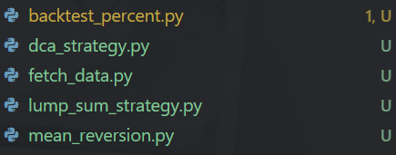
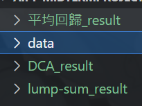

## 選取資料模型
- 黃金 (GOLD)
- APPLE (AAPL)
- Tesla (TSLA)
- TSMC (2330.TW)
- BTC (BTC-USD)
## 時間資料
start_date = "2015-01-01"
end_date = "2025-04-12"

## 1-1

## 1-2
Back-test 資料夾裡的
5年訓練 5年測試

## p2
pairs_strategy.py
結果為result_ml裡 帶有pairs的檔案